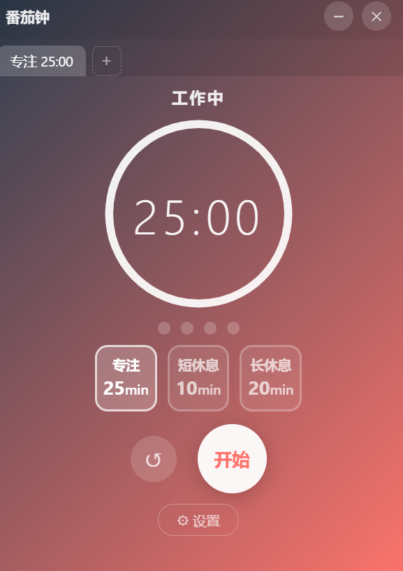
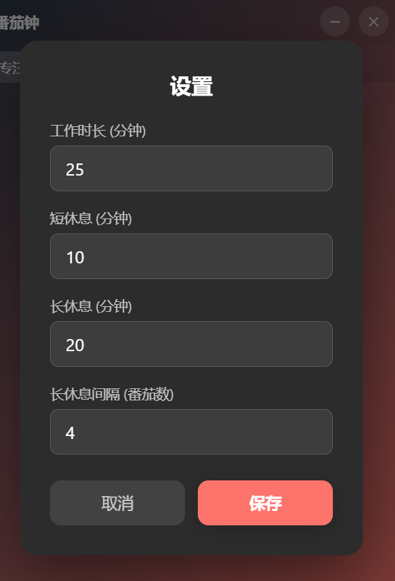

# 小猫钟 (Pomodoro Timer)

一个基于 Electron 的桌面小猫钟应用，支持多标签页、多种计时模式和自定义设置。

## 功能

- **多标签页** - 同时开启多个独立的小猫钟，互不干扰
- **三种计时模式**
  - 专注模式（默认 25 分钟）
  - 短休息（默认 10 分钟）
  - 长休息（默认 20 分钟）
- **圆形进度环** - 实时显示剩余时间，动画流畅
- **提示音** - 计时结束自动播放提示音（Web Audio API 合成）
- **系统通知** - 计时结束弹出桌面通知
- **自定义设置** - 每个标签页可独立配置时长和长休息间隔
- **系统托盘** - 关闭窗口后最小化到托盘，支持后台运行
- **小猫计数** - 记录已完成的小猫数，自动切换长短休息

## 安装

### 环境要求

- [Node.js](https://nodejs.org/) >= 16

### 安装依赖

```bash
npm install
```

### 启动应用

```bash
npm start
```

## 技术栈

- [Electron](https://www.electronjs.org/) - 跨平台桌面应用框架
- HTML / CSS / JavaScript - 原生前端技术，无额外依赖
- Web Audio API - 合成提示音，无需外部音频文件

## 项目结构

```
├── main.js           # Electron 主进程（窗口、托盘、IPC）
├── preload.js        # 预加载脚本（安全的 IPC 桥接）
├── package.json      # 项目配置和依赖
└── renderer/
    ├── index.html    # 主页面结构
    ├── style.css     # 样式（渐变背景、进度环、动画）
    └── app.js        # 计时器逻辑（多标签、状态管理）
```

## 使用说明

1. 点击 **开始** 启动当前模式的倒计时
2. 点击 **暂停** / **继续** 控制计时
3. 点击 **↺** 重置当前计时器
4. 点击顶部模式按钮切换 **专注** / **短休息** / **长休息**
5. 点击标签栏的 **+** 新建小猫钟标签
6. 点击 **⚙ 设置** 自定义时长参数
7. 点击右上角 **✕** 可选择最小化到托盘或退出程序

## 截图

| 主界面 | 设置 |
|--------|------|
|  |  |

## License

MIT
